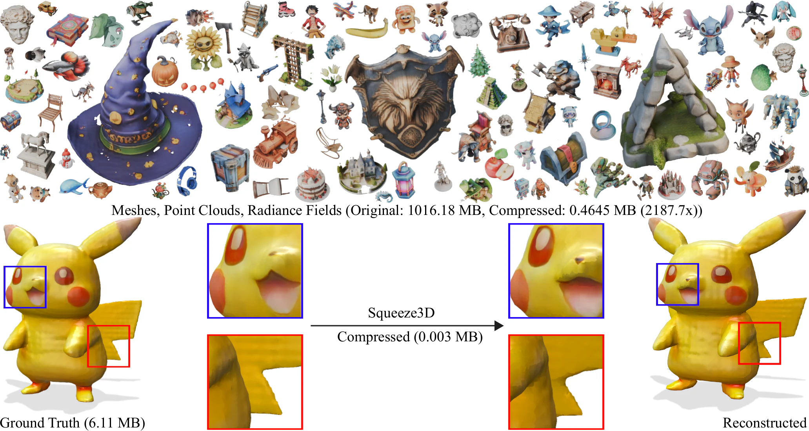
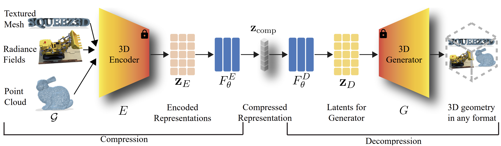
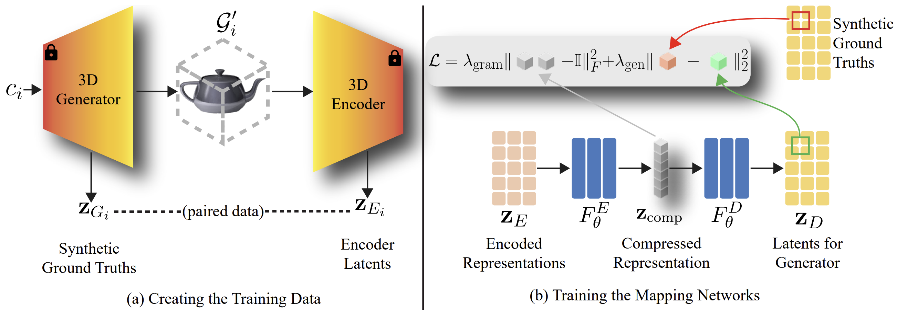
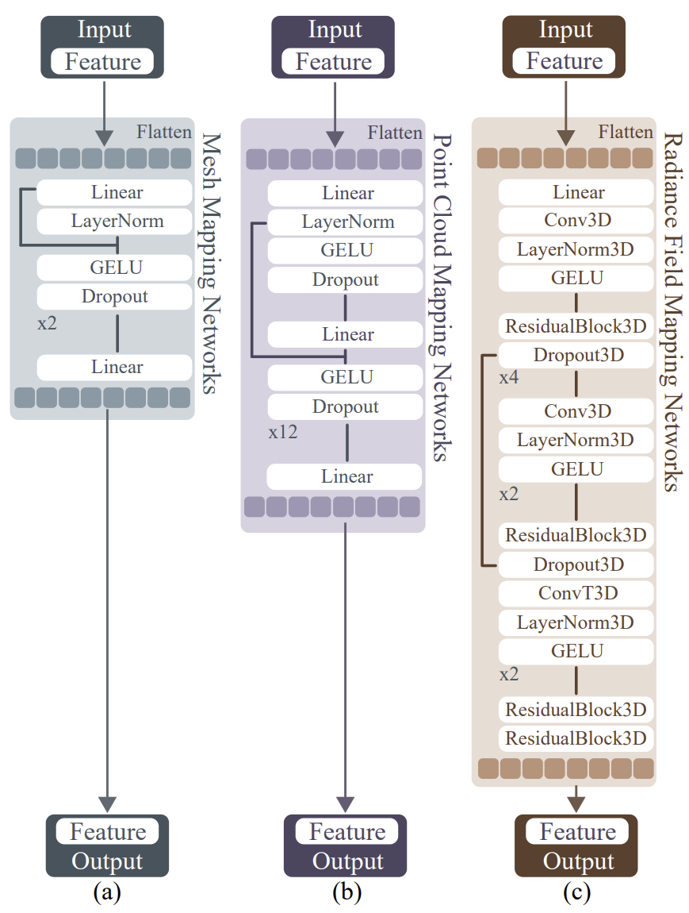

<div align="center">
<h2>Squeeze3D: Your 3D Generation Model is Secretly an Extreme Neural Compressor</h2>

<a href="https://arxiv.org/abs/2506.07932"></a>
<a href='https://squeeze3d.github.io'></a>
<a href='https://huggingface.co/papers/2506.07932'></a>
</div>
</div>



This repository provides the implementation of **Squeeze3D**, an approach that leverages implicit prior knowledge learnt by existing pre-trained 3D generative models to compress 3D data at extremely high compression ratios. Squeeze3D bridges the latent spaces between a pre-trained encoder and a pre-trained generation model through trainable mapping networks.

---

## Contents

- [🔧 Dependencies and Installation](#-dependencies-and-installation)
    * [Setup a Virtual Environment](#setup-a-virtual-environment)
    * [Setup a Conda Environment](#setup-a-conda-environment)
    - [Download the Models](#-download-the-models)
- [🚀 Quick Start](#-quick-start)
- [📖 Overview of the codebase](#-overview-of-the-codebase)
- [📚 Create the dataset](#-create-the-dataset)
   * [Preparing your own data](#preparing-your-own-data)
   * [Preprocessed Datasets](#preprocessed-datasets)
- [💻 Training](#-training)
   * [Training on your own data](#training-on-your-own-data)
   * [Fine-tuning](#fine-tuning)
   * [Trained Models](#trained-models)
- [🤗 Credits](#-credits)
- [📜 Citation](#-citation)

## 🔧 Dependencies and Installation

### Setup a Virtual Environment

All the instructions in this README are meant to be run from the root of the repository.

First set up the environment. We recommend using Python>=3.10, PyTorch>=2.1.0, and CUDA>=12.1. It is okay if some packages show warnings or fail to install due to version conflicts. The version conflicts are not a problem for the functionalities we use.

```bash
git clone --recursive https://github.com/Rishit-dagli/Squeeze3D.git
cd Squeeze3D

# You can install each component step by step following install_env.sh especially if you are using a different CUDA version.
chmod +x install_env.sh
./install_env.sh
```

### Setup a Conda Environment

We also provide a conda environment script to install the dependencies.

```bash
chmod +x install_env_conda.sh
./install_env_conda.sh
```

### Download the Models

Now download the models: MeshAnything, Shap-E, OpenLRM, NeRF-MAE, LION, PointNet++, and InstantMesh. You can also only download the models you need:

- MeshAnything and either Shap-E, OpenLRM, InstantMesh for mesh generation
- PointNet++ and LION for point cloud generation
- NeRF-MAE for radiance field generation

```bash
chmod +x download_models.sh
./download_models.sh
```

## 🚀 Quick Start

The list of models and their download links can be found in the [Trained Models](#trained-models) directory.

1. Compress a mesh:

```bash
python examples/mesh_compression_instantmesh.py \
    assets/meshes/0/mesh.obj \
    --squeeze3d_weights mesh_ma_instantmesh.safetensors \
    --meshanything_weights weights/MeshAnything/MeshAnything_350m.pth \
    --instantmesh_weights weights/instantmesh/instant_mesh_large.ckpt \
    --output_path compressed_mesh.obj
```

2. Compress a point cloud:

```bash
python examples/pc_compression_lion.py \
    assets/pc/0.ply \
    --squeeze3d_weights pc_pn_lion_8192.safetensors \
    --pointnet_weights squeeze3d/Pointnet_Pointnet2_pytorch/log/classification/pointnet2_ssg_wo_normals/checkpoints/best_model.pth \
    --lion_config weights/lion_ckpt/unconditional/all55/cfg.yml \
    --lion_weights weights/lion_ckpt/unconditional/all55/checkpoints/epoch_10999_iters_2100999.pt \
    --output_path compressed_pc.ply \
```

3. Compress a radiance field:

Some example radiance fields can be found [here](https://drive.google.com/file/d/1xxYJMGGJJlHnpmrQx8xQYFpGy3rY4xS1/view?usp=sharing) if you do not want to download the entire dataset.

```bash
python examples/rf_compression_nerfmae.py \
    assets/rf/00009-vLpv2VX547B_0.npz \
    --squeeze3d_weights rf_nerfmae.safetensors \
    --nerfmae_weights weights/NeRF-MAE/nerf_mae_pretrained.pt \
    --output_path compressed_rf.npz
```

## 📖 Overview of the codebase



> [!NOTE]
> The code license only applies to the code we introduce. The following directories have been taken from their respective project directly or with fixes to make it work with our codebase: `instantmesh`, `ldm`, `LION`, `meshanything/2`, `miche`, `nerf_mae`, `nerf_rpn`, `Pointnet_Pointnet2_pytorch`, `OpenLRM`, `PCQM`, `point-cloud-ssim`, and `zero123plus`. You can find their licenses in their respective codebases.

The codebase is organized as follows:

- `squeeze3d/launch_training.py`: Main entry point for training the models.
- `squeeze3d/models/`: Neural network architectures for mapping between latent spaces.
- `squeeze3d/utils/`: Utility functions.
- `squeeze3d/metrics/`: Evaluation metrics for different 3D representations.
- `squeeze3d/optimizers/`: Optimizers for training.
- `dataset_toolkit/`: Tools for dataset creation and preprocessing.
  - `create_dataset_mesh.py`: Create mesh datasets from images or prompts.
  - `create_dataset_pc.py`: Create point cloud datasets.
  - `create_dataset_rf.py`: Create radiance field datasets.
- `configs/`: Configuration files for different experiments.
- `gradio/`: Web demo interface for interactive compression/decompression.
- `weights/`: Directory for storing pretrained model weights.

## 📚 Create the dataset

We provide toolkits for data preparation. The commands also need the respective model weights downlaoded following the instructions above.



For meshes:

The `objaverse-renders` dataset for InstantMesh and OpenLRM was created using [G-buffer Objaverse](https://aigc3d.github.io/gobjaverse/).

```bash
mkdir -p data/
cd data/

# requires git lfs (939 MB)
git clone https://huggingface.co/datasets/rishitdagli/objaverse-renders
cd objaverse-renders
mv part1/*.png part2/*.png ./
rm -rf part1 part2
cd ../..

python dataset_toolkit/create_dataset_mesh.py \
    --model instantmesh \
    --num_samples 10000 \
    --image_dir data/objaverse-renders/ \
    --instantmesh_config weights/instantmesh/instant-mesh-large.yaml \
    --upload_to_hub \
    --repo_id rishitdagli/squeeze3d_mesh_instantmesh \
    --token hf_... \
    --device cuda \
    --use_mesh_to_pc

python dataset_toolkit/create_dataset_mesh.py \
    --model lrm \
    --lrm_model_name zxhezexin/openlrm-obj-base-1.1 \
    --lrm_config_path squeeze3d/OpenLRM/configs/infer-b.yaml \
    --num_samples 10000 \
    --image_dir data/objaverse-renders/ \
    --upload_to_hub \
    --repo_id rishitdagli/squeeze3d_mesh_lrm \
    --token hf_... \
    --device cuda \
    --use_mesh_to_pc


python dataset_toolkit/create_dataset_mesh.py \
    --model shape \
    --num_samples 10000 \
    --prompt_file dataset_toolkit/prompts.txt \
    --upload_to_hub \
    --repo_id rishitdagli/squeeze3d_mesh_shape \
    --token hf_... \
    --device cuda \
    --use_mesh_to_pc \
    --no-noise \
    --batch_size 4
```

For point clouds:

```bash
python dataset_toolkit/create_dataset_pc.py \
    --num_samples 10000 \
    --device cuda \
    --upload_to_hub \
    --repo_id rishitdagli/squeeze3d_pc_lion \
    --token hf_...
```

For radiance fields:

```bash
chmod +x dataset_toolkit/download_rf_data.sh
# (60.6 GB)
./dataset_toolkit/download_rf_data.sh

python dataset_toolkit/create_dataset_rf.py \
    --nerf_dir data/NeRF-MAE/pretrain/features/ \
    --model_path weights/NeRF-MAE/nerf_mae_pretrained.pt \
    --upload_to_hub \
    --repo_id rishitdagli/rf_full \
    --token hf_...
```

### Preparing your own data

To train Squeeze3D on your own data, you need to prepare paired datasets containing both the encoder outputs and the conditioning data (images or text prompts) that will be used by the target generation model. To make such a dataset you need conditioning data for the target generation model.

Your final dataset should be a HuggingFace Dataset with columns:

```python
# Mesh datasets
{
    "inputs": np.array,      # MeshAnything outputs [257, 1024]
    "outputs": np.array,     # Target model latents
    "planes": np.array,      # (InstantMesh only) Triplane features
    "conditioning": {        # Original conditioning data
        "image": PIL.Image,  # For InstantMesh/OpenLRM
        "prompt": str        # For Shap-E
    }
}

# Point cloud datasets  
{
    "inputs": np.array,      # LION outputs [8320]
    "outputs": np.array,     # PointNet++ features [1024]
    "point_cloud": np.array  # Original points [N, 3]
}

# Radiance field datasets
{
    "latent": np.array,      # NeRF-MAE features [256, 20, 20, 20]
    "scene_id": str,         # Scene identifier
    "views": List[PIL.Image] # Original multi-view images
}
```

The provided tools in `dataset_toolkit/` handle the full pipeline automatically. To adapt them for your data:

- Images: Organize in a directory, one image per object
- Text prompts: Create a text file with one prompt per line
- Radiance fields: Save as `.npz` files

### Preprocessed Datasets

We also provide the processed datasets:

| **Dataset** | **Size** | **Disk Size** | **Download** |
|---------|----------|----------|----------|
| Mesh w/ InstantMesh | 10000 | (Not uploaded due to size) | <a href='https://huggingface.co/datasets/rishitdagli/squeeze3d_mesh_instantmesh'></a> |
| Mesh w/ OpenLRM | 10000 | 39.2 GB | <a href='https://huggingface.co/datasets/rishitdagli/squeeze3d_mesh_lrm'></a> |
| Mesh w/ Shap-E | 10000 | (Not uploaded due to size) | <a href='https://huggingface.co/datasets/rishitdagli/squeeze3d_mesh_shape'></a> |
| Point Cloud | 10000 | 387 MB | <a href='https://huggingface.co/datasets/rishitdagli/squeeze3d_pc_lion'></a> |
| Radiance Field | 3260 | 86.6 GB | <a href='https://huggingface.co/datasets/rishitdagli/squeeze3d_rf_nerfmae'></a> |

## 💻 Training



First run `accelerate config` to create a config file, setting your hardware details and if you want to do distributed training.

Training hyperparameters and model architectures are defined in configuration files under the `configs/` directory. Example configuration files include:

| **Config** | **Description** |
|------------|-----------------|
| [`configs/mesh_ma_instantmesh.py`](configs/mesh_ma_instantmesh.py) | Train Mesh Compression with InstantMesh. |
| [`configs/mesh_ma_lrm.py`](configs/mesh_ma_lrm.py) | Train Mesh Compression with OpenLRM. |
| [`configs/mesh_ma_shape.py`](configs/mesh_ma_shape.py) | Train Mesh Compression with Shap-E. |
| [`configs/pc_pn_lion_1024.py`](configs/pc_pn_lion_1024.py) | Train Point Cloud Compression with LION (1024). |
| [`configs/pc_pn_lion_2048.py`](configs/pc_pn_lion_2048.py) | Train Point Cloud Compression with LION (2048). |
| [`configs/pc_pn_lion_4096.py`](configs/pc_pn_lion_4096.py) | Train Point Cloud Compression with LION (4096). |
| [`configs/pc_pn_lion_8192.py`](configs/pc_pn_lion_8192.py) | Train Point Cloud Compression with LION (8192). |
| [`configs/rf_nerfmae.py`](configs/rf_nerfmae.py) | Train Radiance Field Compression with NeRF-MAE. |

Any configuration file can be used to start training with `accelerate` as:

```bash
accelerate launch configs/...
```

First time when you run the above command, it will ask you to login to your WandB account and choose a project as well as login to your HuggingFace account.

### Training on your own data

Once you have prepared your dataset following the format above, training is straightforward:

1. Upload your dataset to HuggingFace Hub or save it locally in a format compatible with `datasets.load_dataset()`

2. Update the dataset parameter in your configuration file:

```python
launch_training(
    # ... other parameters ...
    dataset="your-username/your-dataset-name",  # HuggingFace Hub dataset
    # OR
    dataset="path/to/local/dataset",  # Local dataset
    # ... rest of config ...
)
```

3. Run training with the same command:

```bash
accelerate launch configs/your_config.py
```

### Fine-tuning

Fine-tuning from pre-trained checkpoints is built into the training pipeline:

1. Set `load_state=True` in your configuration file
2. Ensure your checkpoint exists in the `project_dir/checkpoints/` folder
3. The training will automatically resume from the latest checkpoint

```python
launch_training(
    # ... other parameters ...
    load_state=True,
    project_dir="outputs/your_model",  # Must contain checkpoints/ folder
    learning_rate=1e-4,  # Typically use lower LR for fine-tuning
    # ... rest of config ...
)
```

The system automatically finds and loads the latest checkpoint based on iteration number, restores model weights, as well as: optimizer state, and scheduler state if specified (though not useful for fine-tuning), and continues training from the last completed epoch.

### Trained Models

We provide the trained models (16.6 GB) in <a href='https://huggingface.co/rishitdagli/squeeze3d/'></a>.

| **File** | **Representation** | **Latent Size** | **Parameters (M)** | **Generation Model** | **Encoder** |
|------|----------------|------------|-----------------|---------|-----------------|
| `mesh_ma_instantmesh.safetensors` | Mesh | 770 | 96.12 | InstantMesh | MeshAnything |
| `mesh_ma_lrm.safetensors` | Mesh | 1024 | 87.51 | OpenLRM | MeshAnything |
| `mesh_ma_shape.safetensors` | Mesh | 1024 | 134.53 | Shap-E | MeshAnything |
| `pc_pn_lion_1024.safetensors` | Point Cloud | 1024 | 2.11 | LION | PointNet++ |
| `pc_pn_lion_2048.safetensors` | Point Cloud | 2048 | 6.53 | LION | PointNet++ |
| `pc_pn_lion_4096.safetensors` | Point Cloud | 4096 | 22.29 | LION | PointNet++ |
| `pc_pn_lion_8192.safetensors` | Point Cloud | 8192 | 81.48 | LION | PointNet++ |
| `rf_nerfmae.safetensors` | Radiance Field | 24000 | 86.46 | NeRF-MAE | NeRF-MAE |

## 🤗 Credits

This codebase is built on top of, and thanks to the following repositories:

- [InstantMesh](https://github.com/TencentARC/InstantMesh)
- [Shap-E](https://github.com/openai/shap-e)
- [OpenLRM](https://github.com/3DTopia/OpenLRM)
- [NeRF-MAE](https://github.com/zubair-irshad/NeRF-MAE)
- [LION](https://github.com/nv-tlabs/LION)
- [PointNet++](https://github.com/yanx27/Pointnet_Pointnet2_pytorch)
- [MeshAnything](https://github.com/buaacyw/MeshAnything)

## 📜 Citation

If you find Squeeze3D helpful, please consider citing:

```bibtex
@article{dagli2026squeeze3d,
title={Squeeze3D: Extreme Neural Compression with Latent Space Bridging},
author={Rishit Dagli and Yushi Guan and Sankeerth Durvasula and Mohammadreza Mofayezi and Nandita Vijaykumar},
journal={Transactions on Machine Learning Research},
issn={2835-8856},
year={2026},
url={https://openreview.net/forum?id=XXYGHfqzvA}
}
```

